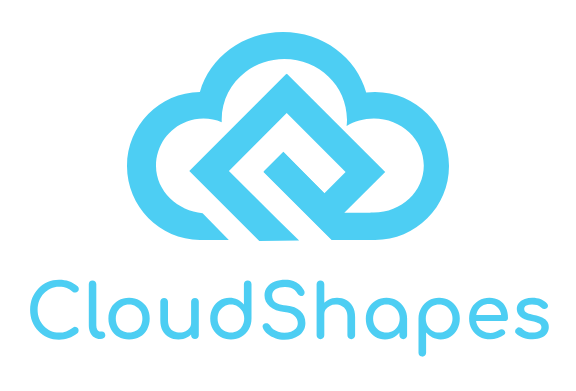

<p align="center">
  
</p>
<hr>

# Event-Driven Projections Database  

**Cloud Shapes** is an **event-driven database** designed to **dynamically generate, update, and delete projections** based on **CloudEvents**. It supports **real-time relationship management**, **embedded data synchronization**, and **write-time updates** for efficient, **event-driven materialization of data**.  

---

## **🔹 Key Features**  

✅ **Projection-Based Data Model** – Store and query data as **projections**, materialized from events.  
✅ **Event-Driven Writes** – Automatically create, update, or delete projections when **CloudEvents** occur.  
✅ **Schema-Enforced Storage** – Validate projection states using **JSON Schema (`JsonSchema`)**.  
✅ **Real-Time Relationship Updates** – Maintain **data consistency** with **embedded relationships**.  
✅ **Write-Time Data Embedding** – Merge related projection data **at write time** for optimized queries.  
✅ **Indexing & Querying** – Define indexes for fast lookups on **projection properties**.  
✅ **Multi-Tenant & Scalable** – Designed for **distributed event-driven architectures**.  

---

## **🔄 How Cloud Shapes Works**  

1. **Define a `ProjectionType`**  
   - Each **projection type** is defined by a **schema (`JsonSchema`)**.  
   - Triggers determine **when new projections should be created** from incoming **CloudEvents**.  

2. **CloudEvents Ingestion**  
   - Events trigger **projections updates**, ensuring real-time **data synchronization**.  

3. **Write-Time Relationship Management**  
   - Projections can **embed related projection data** and update it **dynamically** when relationships change.  

4. **Indexing & Querying**  
   - Projections can be indexed for **efficient lookups** and **optimized queries**.  

---

## **🛠 Example: Defining a `ProjectionType`**
A **projection type** defines how **CloudEvents** affect projections:

```yaml
name: Order
description: >
  The `Order` projection represents an **order entity**, materialized from CloudEvents. 
  It includes **embedded customer and item data** to ensure real-time consistency and optimized query performance.
schema:
  type: object
indexes:
  - name: store
    fields: [ store ]
    unique: false
    descending: false
    text: false
triggers:
  create:
    - event:
        type: io.petstore.events.order.created.v1
        correlation:
          attribute: subject
      state: '${ .data }'
  update:
    - event:
        type: io.petstore.events.order.updated.v1
        correlation:
          attribute: subject
      state: '${ .data }'
  delete:
    - event:
        type: io.petstore.events.order.deleted.v1
        correlation:
          attribute: subject
relationships:
  - type: one-to-one
    target: Customer
    key: customerId
    path: customer
  - type: one-to-many
    target: OrderItem
    key: orderId
    path: items
```

---

## **📌 Example: Order Projection Structure**
When an order is processed, the system **materializes the following JSON projection**:

    ```json
    {
      "id": "order-123",
      "customer": {
        "id": "customer-456",
        "name": "Alice Smith"
      },
      "items": [
        { "id": "item-1", "product": "Laptop", "price": 1000 },
        { "id": "item-2", "product": "Mouse", "price": 50 }
      ],
      "status": "Processing"
    }
    ```

🔹 **Embedded relationships (`customer`, `items`) ensure real-time updates** when related projections change.

---

## **🔄 Real-Time Updates & Event Processing**
Cloud Shapes dynamically updates projections when **CloudEvents** are received:

- **`order.created` → Creates a new projection**  
- **`order.updated` → Modifies the projection**  
- **`order.deleted` → Removes the projection**  

🔹 **Embedded relationships are updated dynamically** at **write time**, ensuring consistency.

---

## **🚀 Why Use Cloud Shapes?**
✅ **Fully Event-Driven** – No manual updates, all changes are event-driven.  
✅ **Real-Time Consistency** – Embedded data updates instantly on related projection changes.  
✅ **Write-Time Optimizations** – Data embedding reduces **query-time overhead**.  
✅ **Schema-Enforced Validation** – Ensures **data integrity** using JSON Schema (`JsonSchema`).  
✅ **Scalable & Distributed** – Built for **high-throughput event-driven systems**.  

---

## **📥 Getting Started**
1️⃣ Clone the **Cloud Shapes** [repository](https://github.com/neuroglia-io/cloud-shapes):  
```sh
git clone https://github.com/neuroglia-io/cloud-shapes.git
```

2️⃣ Start **Cloud Shapes** using **Docker**:
```sh
docker-compose -f deployments/docker-compose/docker-compose.yml up -d
```

3️⃣ Define **Projection Types** and their **Triggers**

4️⃣ Start **ingesting CloudEvents** into the system. 

5️⃣ Query **real-time projections** with **pre-embedded data**. 

---

## **📚 Learn More**
- 📖 [Documentation](#) *(Coming Soon)*
- 🚀 [API Reference](#) *(Coming Soon)*  

---

## **📜 License**
Cloud Shapes is **open-source** and available under the [Apache-2.0 License](LICENSE).  

---

### **🚀 Cloud Shapes: Transforming Events into Real-Time Projections**
